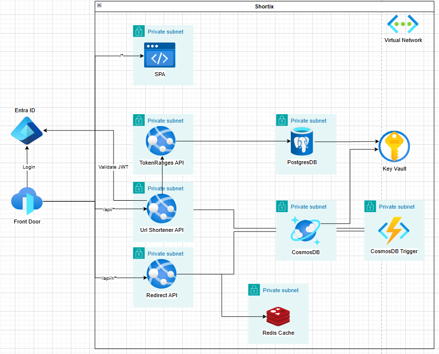

# Architecture

## Overview

Shortix is a URL shortener built for internal use at an e-learning company, designed to handle **1,000 redirect requests per second**. The system uses **Base62** as the short code format, where each code is derived from a monotonically increasing integer token managed by a dedicated service.

The architecture is decomposed into three independently deployable services, each with a clearly scoped responsibility, fronted by Azure Front Door for global routing, WAF protection and TLS termination.

---

## Architecture Diagram



---

## Services

### URL Shortener API

Handles authenticated requests to create and manage short URLs. On startup, the service automatically requests a token range from the Token Range API and holds it **in memory**. Incoming requests consume tokens from the in-memory range to generate Base62 codes — no database round-trip is required for ID generation.

When a range reaches **80% utilization**, the service proactively requests a new range from the Token Range API before the current one is exhausted, ensuring uninterrupted throughput under load. Ranges are kept intentionally small to minimize token loss in the event of an instance crash or restart.

Once a short code is generated, the URL record is written to the CosmosDB `items` container.

- Backed by **CosmosDB** (`items` and `byUser` containers)
- Communicates internally with the **Token Range API** on startup and at 80% range utilization
- Protected by **Azure AD** authentication (`Urls.Read` scope via Entra App Registration)
- Restricted to traffic originating from **Azure Front Door** only

### Token Range API

A dedicated internal service responsible for allocating non-overlapping integer token ranges to URL Shortener API instances. Each instance receives an exclusive range, eliminating any coordination or locking at write time on the URL Shortener side.

**PostgreSQL** was chosen for this component due to its strong consistency guarantees — range allocation must be strictly sequential and conflict-free across all instances.

- Backed by **PostgreSQL Flexible Server** (`ranges` database)
- Accessible **only from the URL Shortener API subnet** — not exposed to Front Door or the internet
- No caching layer; all reads and writes go directly to PostgreSQL to guarantee consistency

### Redirect API

The hot path of the system. Handles all inbound redirect requests (`/api/r/{code}`), resolves the Base62 code to the original URL using the `items` container and returns an HTTP redirect to the client.

**CosmosDB with a per-code partition key** was chosen specifically for this path: since the partition key is the first character of the Base62 ID, lookups are single-partition reads — the fastest possible access pattern in CosmosDB at the expected read volume.

- Backed by **CosmosDB** (`items` container)
- Stateless — no writes, no side effects
- Restricted to traffic originating from **Azure Front Door** only

### Cosmos Trigger Function

An event-driven Azure Function that listens to the CosmosDB Change Feed on the `items` container and propagates each new URL record to the `byUser` container, maintaining a secondary index organized by the creator's email address.

This separation exists because the `items` container is optimized for redirect lookups (partition key: first character of the Base62 ID) and performs poorly for user-scoped queries. The `byUser` container solves this with a partition key mapped to the user's email, making per-user reads efficient.

The propagation is **asynchronous and decoupled** from the write path — it does not add latency to URL creation.

- Triggered by CosmosDB Change Feed on the `items` container
- Writes to the `byUser` container
- Runs inside its own VNet subnet with access to CosmosDB and Key Vault

### Static Web App

The frontend SPA served through Azure Static Web Apps. Authenticates users via the Entra App Registration and communicates with the URL Shortener API through Front Door.

---

## Infrastructure Components

### Azure Front Door

Single ingress point for all external traffic. Provides global anycast routing, WAF with rate limiting, managed TLS certificates and HTTPS enforcement.

| Route Pattern | Backend |
|---|---|
| `/api/r/*` | Redirect API |
| `/api/*` | URL Shortener API |
| `/*` | Static Web App |

Health probes run every 120 seconds on each origin. The `/api/r/*` route is matched before `/api/*` due to Front Door's most-specific-match ordering.

### Virtual Network

All compute and data services run inside a single VNet segmented into 6 dedicated subnets. Service endpoints are configured per subnet to restrict which Azure PaaS services each subnet can reach.

| Subnet | Occupant | Service Endpoints |
|---|---|---|
| `urlShortenerApi` | URL Shortener API | KeyVault, CosmosDB, Web |
| `redirectApi` | Redirect API | KeyVault, CosmosDB |
| `tokenRangeApi` | Token Range API | KeyVault, SQL |
| `cosmosTriggerFunction` | Cosmos Trigger Function | KeyVault, CosmosDB, Storage |
| `redis` | Redis Cache (Private Endpoint) | — |
| `postgres` | PostgreSQL (Private Endpoint) | — |

### Key Vault

Centralized secrets store. All connection strings (CosmosDB, PostgreSQL, Redis) are stored as Key Vault secrets and consumed by services via **Key Vault references** in app settings — no plaintext secrets in configuration. Access is granted exclusively through RBAC (`Key Vault Secrets User` role) to the Managed Identity of each service.

Network access is restricted to the four compute subnets via VNet service endpoint rules.

### CosmosDB

Primary database for URL records. Uses the SQL API with two containers, each optimized for a distinct access pattern:

| Container | Partition Key | Optimized For |
|---|---|---|
| `items` | First character of the Base62 ID | Redirect lookups — single-partition reads at high throughput |
| `byUser` | Creator's email address | Per-user URL listing — populated asynchronously by the Cosmos Trigger Function |

This dual-container design is the core read optimization strategy of the system: rather than forcing one container to serve two incompatible query patterns, each container is purpose-built for its workload.

### PostgreSQL Flexible Server

Stores token range allocations used by the Token Range API. Strong consistency is a hard requirement here — concurrent URL Shortener instances must receive strictly non-overlapping ranges. PostgreSQL's transactional guarantees make it the right choice for this component.

Deployed with `publicNetworkAccess: Disabled` and accessed exclusively via a **Private Endpoint**, with DNS resolution handled by a Private DNS Zone linked to the VNet.

### Redis Cache

Distributed cache deployed with `publicNetworkAccess: Disabled`, accessible only via a **Private Endpoint**. AAD authentication is enabled.

### Log Analytics Workspace + Application Insights

Each compute service has a dedicated **Application Insights** instance linked to a shared **Log Analytics Workspace**, enabling cross-service query, distributed tracing and centralized alerting from a single workspace.

---

## Security Model

| Concern | Mechanism |
|---|---|
| Identity | System-assigned Managed Identity on all compute |
| Secret access | RBAC role assignment — no access policies |
| Secret storage | Key Vault references in app settings |
| Network ingress | IP restrictions — default deny on all App Services |
| Front Door bypass prevention | `AzureFrontDoor.Backend` service tag restriction |
| Internal service isolation | Subnet-level IP restriction (Token Range API) |
| Data plane isolation | VNet service endpoints (CosmosDB, Key Vault) + Private Endpoints (PostgreSQL, Redis) |
| TLS | HTTPS-only on all App Services, minimum TLS 1.2 |
| WAF | Rate limiting via Azure Front Door WAF Policy |
| Deploy access | SCM restricted to `AzureCloud` service tag (GitHub Actions) |

---

## Data Flows

### Creating a Short URL

```
[On instance startup]
URL Shortener API
  → Token Range API (internal, subnet-restricted)
      → PostgreSQL: allocate and persist the next available range
  ← range assigned to this instance (e.g. 1000–1999), held in memory

[Proactive range refresh — triggered at 80% utilization]
URL Shortener API
  → Token Range API: request the next range
  ← new range reserved (e.g. 2000–2999), buffered in memory

[Write request]
Authenticated user → Front Door (/api/*)
  → URL Shortener API
      → consume next token from in-memory range
      → encode token as Base62 short code
      → CosmosDB: write to `items` container
                  (partition key = first char of Base62 code)
      ← short code returned to user

[Async propagation — does not block the write response]
CosmosDB Change Feed
  → Cosmos Trigger Function
      → CosmosDB: write to `byUser` container
                  (partition key = creator's email)
```

### Redirecting a Short URL

```
Anonymous user → Front Door (/api/r/{base62code})
  → Redirect API
      → CosmosDB: single-partition lookup in `items` container
                  (partition key = first char of base62code)
      ← original URL resolved
  ← HTTP 301/302 redirect to original URL
```

### Listing URLs by User

```
Authenticated user → Front Door (/api/*)
  → URL Shortener API
      → CosmosDB: query `byUser` container
                  (partition key = user's email)
      ← list of URLs created by this user
```